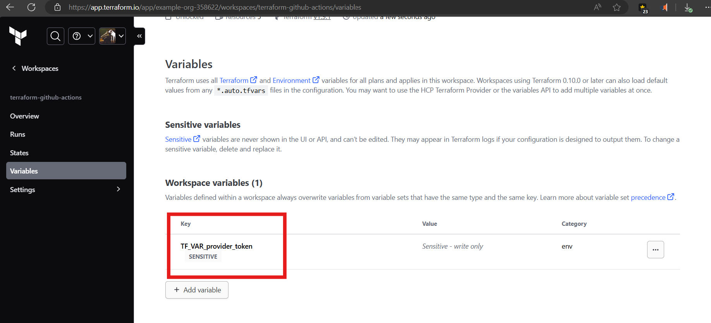
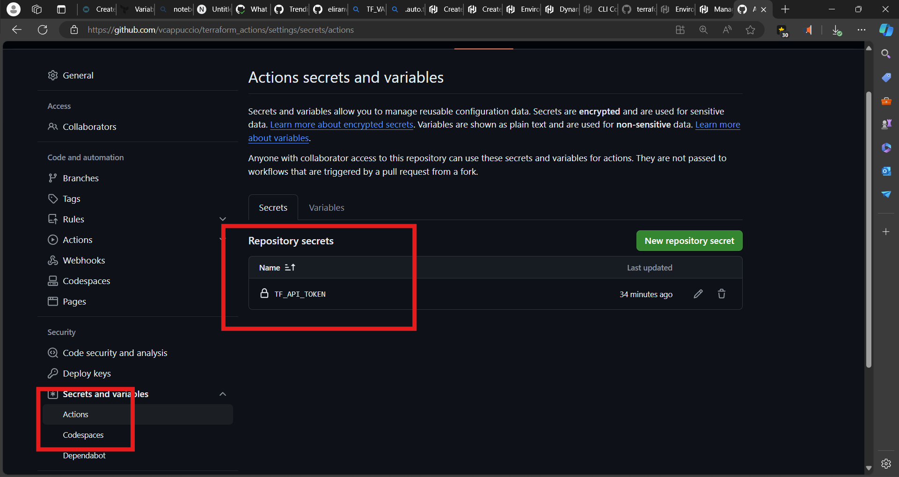

Based of:

https://developer.hashicorp.com/terraform/tutorials/automation/github-actions

https://developer.hashicorp.com/terraform/cloud-docs/workspaces/variables/managing-variables#workspace-specific-variables

**HashiCorp Cloud Platform (HCP)**

[variable "provider_token"](provider.tf#L3) 

[Sensitive variables](provider.tf#L3)  store confidential information like API keys or passwords. 

HCP Terraform encrypts these values at rest using Vault's transit backend, ensuring only authorized users and processes can access them. 

The sentence "**HCP Terraform encrypts these values at rest using Vault's transit backend, ensuring only authorized users and processes can access them**" means that HCP Terraform uses a system called Vault to encrypt variable values to protect them. This encryption happens "at rest," meaning the values are encrypted while stored and not actively being used. Only users and processes with the proper authorization can access and decrypt these values. However, it's important to note that HCP Terraform stores variable descriptions in plain text without encryption. 

Marking a variable as sensitive hides its value in the UI and API responses.

